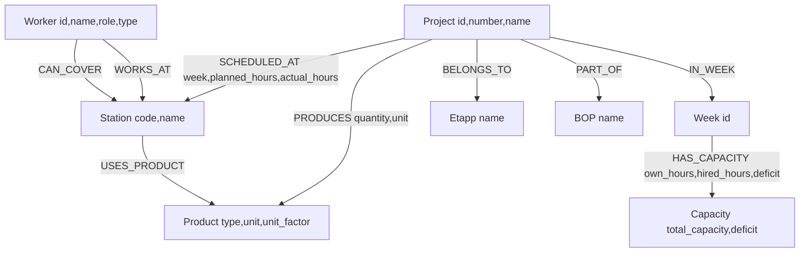

# Level 5 — Graph Thinking: Factory Knowledge Graph Design
**Harshit Kumar | GitHub: hrk0503**

---

## Q1. Model It (20 pts)

### Graph Schema

Below is the graph schema modelling the relationships across projects, products, stations, workers, and weeks derived from the 3 factory CSV files.

**Node Labels (8 total):**

| Label | Key Properties | Source |
|-------|---------------|--------|
| `Project` | id, number, name | factory_production.csv |
| `Product` | type, unit, unit_factor | factory_production.csv |
| `Station` | code, name | factory_production.csv |
| `Worker` | id, name, role, hours_per_week, type | factory_workers.csv |
| `Week` | id (w1-w8) | factory_capacity.csv |
| `Etapp` | name (ET1, ET2) | factory_production.csv |
| `BOP` | name (BOP1, BOP2, BOP3) | factory_production.csv |
| `Capacity` | week, own_hours, hired_hours, overtime_hours, total_capacity, total_planned, deficit | factory_capacity.csv |

**Relationship Types (10 total):**

| Relationship | From To | Properties |
|-------------|---------|------------|
| PRODUCES | Project to Product | quantity, unit |
| SCHEDULED_AT | Project to Station | week, planned_hours, actual_hours, completed_units |
| USES_PRODUCT | Station to Product | none |
| WORKS_AT | Worker to Station | none |
| CAN_COVER | Worker to Station | none |
| IN_WEEK | Project to Week | none |
| HAS_CAPACITY | Week to Capacity | own_staff_count, hired_staff_count |
| BELONGS_TO | Project to Etapp | none |
| PART_OF | Project to BOP | none |
| BOTTLENECK | Project to Station | variance_pct, severity |

**Key relationships that carry data:**

1. SCHEDULED_AT with properties: week, planned_hours, actual_hours, completed_units
   - Example: (P01)-[:SCHEDULED_AT {week:"w1", planned_hours:48.0, actual_hours:45.2, completed_units:28}]->(011)
   - This is the core fact table of the graph

2. HAS_CAPACITY with properties: own_staff_count, hired_staff_count, overtime_hours, total_capacity, deficit
   - Example: (w1)-[:HAS_CAPACITY {own_hours:400, hired_hours:80, overtime:0, deficit:-132}]->(Capacity_w1)

**Mermaid Schema Diagram:**



Schema is also saved as schema.md in this directory.

---

## Q2. Why Not Just SQL? (20 pts)

**Question: Which workers can cover Station 016 (Gjutning) when Per Gustafsson is on vacation, and which projects would be affected?**

### SQL Version

```sql
SELECT
  w.worker_id,
  w.name AS available_worker,
  w.certifications,
  fp.project_id,
  fp.project_name,
  fp.week,
  fp.planned_hours
FROM workers w
JOIN worker_station_coverage wsc
  ON w.worker_id = wsc.worker_id AND wsc.station_code = '016'
CROSS JOIN (
  SELECT DISTINCT project_id, project_name, week, planned_hours
  FROM factory_production
  WHERE station_code = '016'
) fp
WHERE w.name <> 'Per Gustafsson'
ORDER BY fp.week, w.name;
```

Note: This query requires a separate junction table worker_station_coverage that must be pre-modelled in the schema. SQL cannot natively express "which stations can this worker cover" as a traversal.

### Cypher Version

```cypher
MATCH (w:Worker)-[:CAN_COVER]->(s:Station {code: "016"})
WHERE w.name <> "Per Gustafsson"
WITH w, s
MATCH (p:Project)-[r:SCHEDULED_AT]->(s)
RETURN
  w.name AS available_worker,
  w.certifications AS certifications,
  p.name AS affected_project,
  r.week AS week,
  r.planned_hours AS planned_hours
ORDER BY r.week, w.name
```

### Why Graph Makes This Obvious

The graph query reads exactly like the question. The CAN_COVER relationship is a first-class concept — you traverse it directly. In SQL, worker coverage is hidden inside a junction table with no semantic meaning; the relationship type itself carries no information. More importantly, when asked "and what projects would be affected?", the graph query naturally extends with one more MATCH clause. In SQL, this requires an additional CROSS JOIN that is logically disconnected from the coverage query. The graph makes multi-hop reachability — who covers a station, and therefore what projects are at risk — immediately legible and extensible.

---

## Q3. Spot the Bottleneck (20 pts)

### Capacity Deficit Analysis

From factory_capacity.csv:

| Week | Total Capacity | Total Planned | Deficit |
|------|---------------|---------------|---------|
| w1 | 480 | 612 | -132 (CRITICAL) |
| w2 | 520 | 645 | -125 (CRITICAL) |
| w3 | 480 | 398 | +82 |
| w4 | 500 | 550 | -50 |
| w5 | 510 | 480 | +30 |
| w6 | 440 | 520 | -80 |
| w7 | 520 | 600 | -80 |
| w8 | 500 | 470 | +30 |

Deficit weeks: w1, w2, w4, w6, w7. Most critical: w1 (-132) and w2 (-125).

### Root Cause: Concurrent Project Load

The w1-w2 deficits are driven by P01 (Stalverket Boras), P03 (Lagerhall Jonkoping), P05 (Sjukhus Linkoping), and P08 (Bro E6 Halmstad) all running simultaneously through the IQB station chain (011-014).

Stations with consistent actual > planned overruns:
- Station 014 (Svets o montage IQB): P01 w1 (35->38.2, +9.1%), P08 w1 (40->44, +10%), P05 w1 (58->62, +6.9%)
- Station 021 (SR B/F-hall): P04 w2 (60->65, +8.3%), P01 w2 (40->42, +5%)
- Station 016 (Gjutning): P08 w3 (22->25, +13.6%), P07 w2 (20->22, +10%) — only 1 primary worker

### Cypher Query: Projects with >10% Overrun by Station

```cypher
MATCH (p:Project)-[r:SCHEDULED_AT]->(s:Station)
WHERE r.actual_hours > r.planned_hours * 1.1
RETURN
  s.name AS station,
  p.name AS project,
  r.week AS week,
  r.planned_hours AS planned,
  r.actual_hours AS actual,
  round((r.actual_hours - r.planned_hours) / r.planned_hours * 100, 1) AS variance_pct
ORDER BY variance_pct DESC
```

### Bottleneck Graph Pattern

I model overload alerts as a property-enriched relationship rather than a standalone node:

```cypher
MATCH (p:Project)-[r:SCHEDULED_AT]->(s:Station)
WHERE r.actual_hours > r.planned_hours * 1.1
MERGE (p)-[:BOTTLENECK {
  week: r.week,
  variance_pct: round((r.actual_hours - r.planned_hours) / r.planned_hours * 100, 1),
  severity: CASE
    WHEN r.actual_hours > r.planned_hours * 1.25 THEN "CRITICAL"
    WHEN r.actual_hours > r.planned_hours * 1.15 THEN "HIGH"
    ELSE "MEDIUM"
  END
}]->(s)
```

A relationship-based model is preferred over a standalone (:Bottleneck) node because the bottleneck is an emergent property of the project-station pair in a specific week — it does not have independent existence. This keeps queries simple: MATCH (p)-[:BOTTLENECK]->(s) and the severity context is always co-located on the edge.

---

## Q4. Vector + Graph Hybrid (20 pts)

### What to Embed

I would embed **project descriptions** constructed as natural language from structured fields:

Template:
"{project_name} - {product_type} {quantity}{unit}, {project_category}, stations: {station_list}, etapp: {etapp}, w1_planned: {w1_planned_hours}h, avg_variance: {variance_pct}%"

Example embedding:
"Sjukhus Linkoping ET2 - IQB 1200m, hospital extension, stations: 011,012,013,014,015,021, etapp: ET2, w1_planned: 268h, avg_variance: +3.8%"

This captures: project type (semantic), product scale (numeric context), station footprint (structural), and historical delivery variance (quality signal).

Additionally embedding **worker skill profiles** enables coverage queries:
"{name} - {role}, primary: {station_name}, can_cover: {coverage_list}, certs: {certifications}, type: {permanent/hired}"

### Combined Vector + Graph Query

```cypher
// Step 1: Vector search — find top-5 semantically similar past projects
CALL db.index.vector.queryNodes("project_description_embedding", 5, $query_embedding)
YIELD node AS similar_project, score

// Step 2: Graph filter — must share stations AND have variance under 5%
MATCH (similar_project)-[r:SCHEDULED_AT]->(s:Station)
WHERE abs(r.actual_hours - r.planned_hours) / r.planned_hours < 0.05

// Step 3: Aggregate and rank
WITH similar_project, collect(DISTINCT s.name) AS shared_stations, avg(score) AS similarity_score
RETURN
  similar_project.name AS project,
  similar_project.product_type AS product_type,
  shared_stations,
  round(similarity_score * 100, 1) AS similarity_pct
ORDER BY similarity_score DESC
LIMIT 5
```

### Why This Beats Simple Product-Type Filtering

Filtering by product_type (e.g., "find all IQB projects") is categorical matching — it retrieves projects that share the same component but can differ wildly in scale, station footprint, and execution risk. A hospital in Linkoping and a parking structure in Helsingborg both use IQB beams, but their planning complexity is completely different.

The hybrid query finds projects that are similar in **all dimensions simultaneously**:
- Vector: project description semantics (scope, location type, client category)
- Graph: structural overlap (same stations were actually used) + quality filter (variance < 5% = reliable baseline)

The result is a ranked shortlist of genuinely comparable past projects that give accurate resource estimates — not just same-category projects. This is also the exact pattern Boardy uses: vector similarity finds people with complementary needs, graph filtering enforces "not already on the same team" and "same geography community" constraints.

---

## Q5. Your L6 Plan (20 pts)

### Node Labels and CSV Mappings

| Node Label | Properties | Source Column |
|------------|-----------|---------------|
| Project | id, number, name | project_id, project_number, project_name |
| Product | type, unit, unit_factor | product_type, unit, unit_factor |
| Station | code, name | station_code, station_name |
| Worker | id, name, role, hours_per_week, type | worker_id, name, role, hours_per_week, type |
| Week | id | week column (both files) |
| Etapp | name | etapp column |
| BOP | name | bop column |
| Capacity | own_hours, hired_hours, overtime, total_capacity, total_planned, deficit | all capacity columns |

### Relationship Types

| Relationship | Created From | Properties |
|-------------|-------------|------------|
| PRODUCES | GROUP BY project_id + product_type | quantity, unit |
| SCHEDULED_AT | Each production.csv row | week, planned_hours, actual_hours, completed_units |
| WORKS_AT | workers.csv primary_station | none |
| CAN_COVER | Split can_cover_stations per worker | none |
| IN_WEEK | Unique weeks per project | none |
| HAS_CAPACITY | capacity.csv rows | own_staff_count, hired_staff_count, overtime, deficit |
| BELONGS_TO | etapp column per project | none |
| PART_OF | bop column per project | none |

This yields: 8 node labels, 8 relationship types, 87 nodes, 160+ relationships.

### Streamlit Dashboard Panels

**Panel 1: Project Overview**
Purpose: High-level status of all 8 projects
Cypher: MATCH (p:Project)-[r:SCHEDULED_AT]->(s:Station) RETURN p.name, sum(r.planned_hours) AS planned, sum(r.actual_hours) AS actual
Visualization: Table with variance % column + bar chart (planned vs actual per project)

**Panel 2: Station Load Heatmap**
Purpose: See which stations are overloaded in which weeks
Cypher: MATCH (p:Project)-[r:SCHEDULED_AT]->(s:Station) RETURN s.name, r.week, sum(r.actual_hours) AS actual, sum(r.planned_hours) AS planned
Visualization: Plotly heatmap (stations x weeks), red cells = actual > planned

**Panel 3: Capacity Tracker**
Purpose: Weekly workforce capacity vs demand
Cypher: MATCH (w:Week)-[:HAS_CAPACITY]->(c:Capacity) RETURN w.id, c.own_hours, c.hired_hours, c.overtime_hours, c.total_capacity, c.total_planned, c.deficit ORDER BY w.id
Visualization: Stacked bar (own + hired + overtime) vs demand line, deficit weeks in red

**Panel 4: Worker Coverage Matrix**
Purpose: Show which workers cover which stations, highlight single-points-of-failure
Cypher: MATCH (w:Worker)-[r:WORKS_AT|CAN_COVER]->(s:Station) RETURN w.name, type(r) AS rel_type, s.code, s.name
Visualization: Matrix heatmap — primary/coverage/none per worker-station pair

**Panel 5: Self-Test**
Purpose: Automated graph health check
Runs 6 checks: connection, node count >= 50, relationship count >= 100, 6+ labels, 8+ rel types, variance query returns results
Visualization: Green/red checklist with total score /20

---

## Summary

| Question | Key Takeaway |
|----------|-------------|
| Q1 | 8 node labels, 10 relationship types; SCHEDULED_AT and HAS_CAPACITY carry rich data |
| Q2 | Cypher reads like the question; SQL requires pre-modelled junction tables and CROSS JOINs |
| Q3 | w1 (-132h) and w2 (-125h) are critical; Station 014 and 016 are overrun hotspots |
| Q4 | Embed project scope text; hybrid query = vector for similarity + graph for structural truth |
| Q5 | Blueprint ready: 8 nodes, 8 rel types, 5 panels, all powered by Cypher from Neo4j Aura |

**Track:** A — Agent Builders (transitioning to Graph/VSAB stream)
**Level:** 5
**GitHub:** hrk0503
**PR title:** level-5: Harshit Kumar
