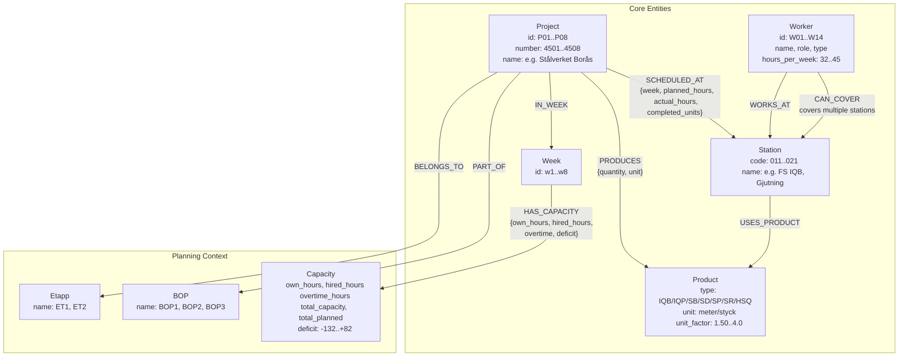

# Factory Knowledge Graph Schema
**Level 5 — Harshit Kumar (hrk0503)**

## Graph Schema Diagram

## Node Summary

| Label | Count | Key Properties |
|-------|-------|---------------|
| Project | 8 | id, number, name |
| Product | 7 | type (IQB,IQP,SB,SD,SP,SR,HSQ), unit, unit_factor |
| Station | 9 | code (011-021), name |
| Worker | 13 | id, name, role, hours_per_week, type |
| Week | 8 | id (w1-w8) |
| Etapp | 2 | name (ET1, ET2) |
| BOP | 3 | name (BOP1, BOP2, BOP3) |
| Capacity | 8 | own_hours, hired_hours, overtime, total_capacity, deficit |

**Total nodes: ~58+**

## Relationship Summary

| Type | Count (approx.) | Carries Data? |
|------|----------------|---------------|
| SCHEDULED_AT | 68 | Yes — week, planned_hours, actual_hours, completed_units |
| HAS_CAPACITY | 8 | Yes — own_staff_count, hired_staff_count, overtime, deficit |
| PRODUCES | 8+ | Yes — quantity, unit |
| WORKS_AT | 13 | No |
| CAN_COVER | 25+ | No |
| IN_WEEK | 30+ | No |
| BELONGS_TO | 8 | No |
| PART_OF | 8 | No |

**Total relationships: 160+**

## Key Design Decisions

1. **SCHEDULED_AT is the fact table**: Each row of factory_production.csv becomes one SCHEDULED_AT relationship with week, planned, actual, and completed_units as properties. This mirrors how a data warehouse fact table works, but as a traversable edge.

2. **CAN_COVER vs WORKS_AT**: Separated intentionally. WORKS_AT = primary responsibility. CAN_COVER = certified backup. This distinction is essential for the coverage query (Q2).

3. **Week as a node**: Makes temporal queries trivial — MATCH (w:Week {id:"w1"})-[:HAS_CAPACITY]->(c) — instead of filtering by string properties.

4. **BOTTLENECK as a derived relationship**: Not seeded from CSV, but computed post-load: when actual_hours > planned_hours * 1.1, a BOTTLENECK edge is created with variance_pct and severity. This is an emergent graph pattern on top of the base data.

## Station Reference

| Code | Name | Primary Worker |
|------|------|---------------|
| 011 | FS IQB | Erik Lindberg (W01) |
| 012 | Förmontering IQB | Lars Jensen (W03) |
| 013 | Montering IQB | Maria Stone (W04) |
| 014 | Svets o montage IQB | Johan Peters (W05) |
| 015 | Montering IQP | Karen Nilsen (W06) |
| 016 | Gjutning | Per Hansen (W07) |
| 017 | Målning | Sofia Arden (W08) |
| 018 | SB B/F-hall | Magnus Stone (W09) |
| 019 | SP B/F-hall | Elin Frank (W10) |
| 021 | SR B/F-hall | Victor Elm (W11, Foreman) |
