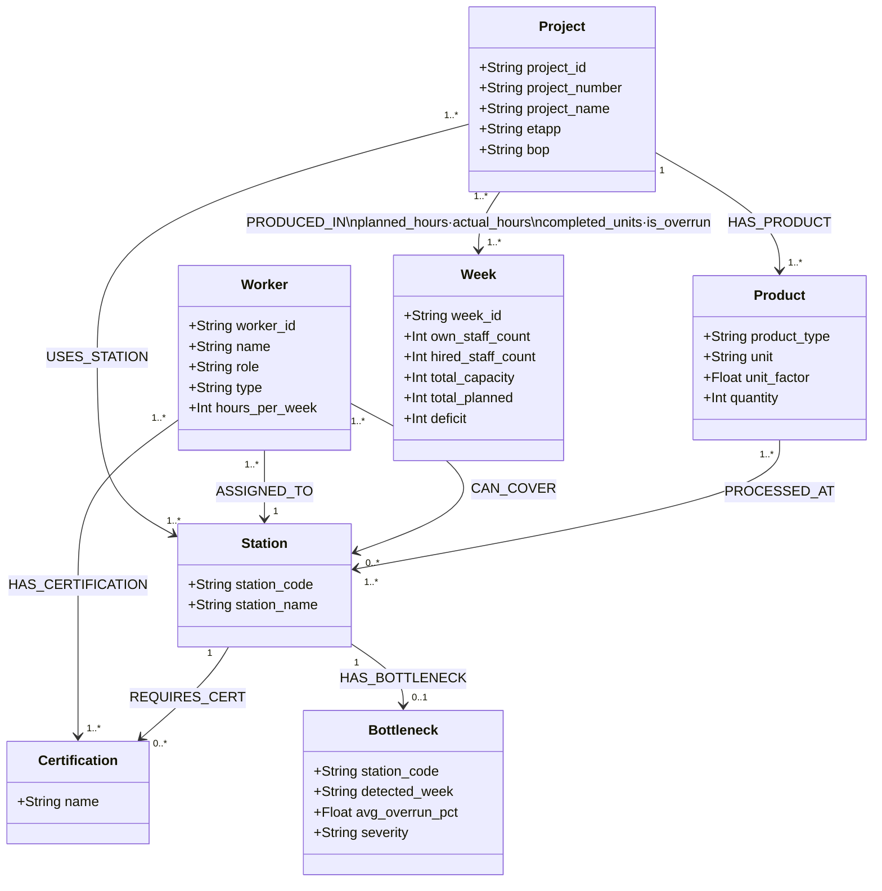

# Level 5 — Graph Thinking
**Submitted by:** Sania Gurung  
**Date:** 2026-05-09

---

## Q1. Model It (20 pts)

See `schema.md` for the full Mermaid UML class diagram.

### Node Labels (7 total)

| Node | Properties | Source CSV |
|------|-----------|------------|
| `:Project` | project_id, project_number, project_name, etapp, bop | factory_production.csv |
| `:Product` | product_type, unit, unit_factor, quantity | factory_production.csv |
| `:Station` | station_code, station_name | factory_production.csv / factory_workers.csv |
| `:Worker` | worker_id, name, role, type, hours_per_week | factory_workers.csv |
| `:Week` | week_id, own_staff_count, hired_staff_count, total_capacity, total_planned, deficit | factory_capacity.csv |
| `:Certification` | name | factory_workers.csv |
| `:Bottleneck` | station_code, detected_week, avg_overrun_pct, severity | derived from factory_production.csv |

### Relationship Types (9 total)

| Relationship | Properties | Description |
|---|---|---|
| `(:Project)-[:HAS_PRODUCT]->(:Product)` | — | A project produces a product type |
| `(:Project)-[:USES_STATION]->(:Station)` | — | A project runs work through a station |
| `(:Project)-[:PRODUCED_IN {planned_hours, actual_hours, completed_units, is_overrun}]->(:Week)` | **planned_hours, actual_hours, completed_units, is_overrun** | One entry per production row; tracks progress |
| `(:Worker)-[:ASSIGNED_TO]->(:Station)` | — | Worker's primary/home station |
| `(:Worker)-[:CAN_COVER {certified}]->(:Station)` | **certified** | Stations the worker is qualified to cover |
| `(:Worker)-[:HAS_CERTIFICATION]->(:Certification)` | — | Worker holds this cert |
| `(:Station)-[:REQUIRES_CERT]->(:Certification)` | — | Station mandates this cert to operate |
| `(:Product)-[:PROCESSED_AT]->(:Station)` | — | Which station handles a product type |
| `(:Station)-[:HAS_BOTTLENECK]->(:Bottleneck)` | — | Alert node when overrun is chronic |

---

## Q2. Why Not Just SQL? (20 pts)

**Question:** Which workers are certified to cover Station 016 (Gjutning) when Per Hansen is on vacation, and which projects would be affected?

### Answer from the data

Looking at `factory_workers.csv`:
- **Per Hansen (W07)** is the primary worker at station 016, certifications: Casting, Formwork
- Workers whose `can_cover_stations` includes `016`:
  - **Victor Elm (W11, Foreman)** — can cover all stations, including 016

Only **Victor Elm** can substitute. This makes station 016 a **single-point-of-failure** station — one person away from a staffing crisis.

Projects currently scheduled at station 016 (from `factory_production.csv`):
- **P03** — Lagerhall Jönköping (w2)
- **P05** — Sjukhus Linköping ET2 (w2)
- **P07** — Idrottshall Västerås (w2)
- **P08** — Bro E6 Halmstad (w3)

All 4 projects would be at risk.

---

### SQL Version

```sql
-- Step 1: find workers who can cover station 016 (excluding Per Hansen)
SELECT w.name, w.role
FROM workers w
WHERE w.name <> 'Per Hansen'
  AND (
      w.primary_station = '016'
      OR '016' = ANY(string_to_array(w.can_cover_stations, ','))
  );

-- Step 2: find projects scheduled at station 016
SELECT DISTINCT p.project_name, p.week
FROM production p
WHERE p.station_code = '016';
```

Note: `can_cover_stations` is stored as a comma-separated string in SQL, requiring `string_to_array()` or `LIKE '%016%'` — a hack, not a design.

---

### Cypher Version

```cypher
MATCH (substitute:Worker)-[:CAN_COVER]->(s:Station {station_code: '016'})
WHERE substitute.name <> 'Per Hansen'
WITH substitute, s
MATCH (affected:Project)-[:USES_STATION]->(s)
RETURN substitute.name         AS substitute,
       substitute.role         AS role,
       collect(DISTINCT affected.project_name) AS affected_projects
```

---

### What the Graph Makes Obvious That SQL Hides

In SQL, worker coverage is flattened into a comma-delimited string column — the relationship between "who can cover what" is not a first-class citizen of the schema, so tracing the impact from a worker's absence to affected projects requires two disconnected queries and manual string parsing. In the graph, the path `(:Worker)-[:CAN_COVER]->(:Station)<-[:USES_STATION]-(:Project)` encodes the entire dependency chain structurally — one traversal reveals both the substitute and the at-risk projects simultaneously. The graph also makes the staffing gap visible immediately: only one substitute exists for station 016, which a graph visualization flags as a single-point-of-failure without any extra logic.

---

## Q3. Spot the Bottleneck (20 pts)

### Part 1: Which projects/stations cause the overload?

Weeks with capacity deficit from `factory_capacity.csv`:

| Week | Total Capacity | Total Planned | Deficit |
|------|---------------|---------------|---------|
| w1   | 480           | 612           | **-132** |
| w2   | 520           | 645           | **-125** |
| w3   | 480           | 398           | +82     |
| w4   | 500           | 550           | **-50** |
| w5   | 510           | 480           | +30     |
| w6   | 440           | 520           | **-80** |
| w7   | 520           | 600           | **-80** |
| w8   | 500           | 470           | +30     |

Rows from `factory_production.csv` where `actual_hours > planned_hours × 1.10`:

| Project | Station | Week | Planned | Actual | Overrun % |
|---------|---------|------|---------|--------|-----------|
| P03 — Lagerhall Jönköping | 016 Gjutning | w2 | 28.0 | 35.0 | **+25.0%** |
| P05 — Sjukhus Linköping ET2 | 016 Gjutning | w2 | 35.0 | 40.0 | **+14.3%** |
| P08 — Bro E6 Halmstad | 016 Gjutning | w3 | 22.0 | 25.0 | **+13.6%** |
| P04 — Parkering Helsingborg | 018 SB B/F-hall | w1 | 19.0 | 22.0 | **+15.8%** |
| P07 — Idrottshall Västerås | 018 SB B/F-hall | w1 | 16.0 | 18.0 | **+12.5%** |
| P06 — Skola Uppsala | 018 SB B/F-hall | w2 | 16.0 | 18.0 | **+12.5%** |
| P03 — Lagerhall Jönköping | 014 Svets o montage | w1 | 42.0 | 48.0 | **+14.3%** |
| P02 — Kontorshus Mölndal | 012 Förmontering IQB | w1 | 22.0 | 24.5 | **+11.4%** |
| P01 — Stålverket Borås | 012 Förmontering IQB | w1 | 32.0 | 35.5 | **+10.9%** |

**Root cause:** Station 016 (Gjutning) is the worst bottleneck — it runs 13.6–25% over plan across 3 different projects in consecutive weeks (w2, w3). Station 018 (SB B/F-hall) is the second chronic overloader, appearing in 3 projects across w1–w2. These two stations are the primary drivers of the w1 (-132) and w2 (-125) deficits.

---

### Part 2: Cypher Query — Overruns >10% Grouped by Station

```cypher
MATCH (proj:Project)-[r:PRODUCED_IN]->(w:Week),
      (proj)-[:USES_STATION]->(s:Station)
WHERE r.actual_hours > r.planned_hours * 1.10
RETURN s.station_name                                                        AS station,
       count(r)                                                              AS overrun_count,
       round(avg((r.actual_hours - r.planned_hours) / r.planned_hours * 100), 1) AS avg_overrun_pct,
       collect({
           project: proj.project_name,
           week: w.week_id,
           planned: r.planned_hours,
           actual: r.actual_hours,
           pct: round((r.actual_hours - r.planned_hours) / r.planned_hours * 100, 1)
       }) AS details
ORDER BY avg_overrun_pct DESC
```

---

### Part 3: Modelling the Bottleneck Alert as a Graph Pattern

I recommend **Option C — both a relationship property and a `:Bottleneck` node**:

**Step 1 — flag individual production rows on the relationship:**
```cypher
// Set is_overrun = true on the relationship itself during data load
MATCH (proj:Project)-[r:PRODUCED_IN]->(w:Week)
WHERE r.actual_hours > r.planned_hours * 1.10
SET r.is_overrun = true,
    r.overrun_pct = round((r.actual_hours - r.planned_hours) / r.planned_hours * 100, 1)
```

**Step 2 — create a `:Bottleneck` node on a station when overruns appear in 2+ weeks:**
```cypher
MATCH (s:Station)<-[:USES_STATION]-(proj:Project)-[r:PRODUCED_IN]->(w:Week)
WHERE r.is_overrun = true
WITH s, count(DISTINCT w.week_id) AS overrun_weeks, avg(r.overrun_pct) AS avg_pct
WHERE overrun_weeks >= 2
MERGE (b:Bottleneck {station_code: s.station_code})
SET b.avg_overrun_pct = round(avg_pct, 1),
    b.severity = CASE WHEN avg_pct > 20 THEN 'CRITICAL' WHEN avg_pct > 10 THEN 'HIGH' ELSE 'MEDIUM' END
MERGE (s)-[:HAS_BOTTLENECK]->(b)
```

This approach gives two levels of granularity: the `is_overrun` flag on each `PRODUCED_IN` relationship lets you query individual overrun events, while the `(:Bottleneck)` node represents a chronic station-level problem that persists across weeks — and can be queried in one hop from the station.

---

## Q4. Vector + Graph Hybrid (20 pts)

**New request:** *"450 meters of IQB beams for a hospital extension in Linköping, similar scope to previous hospital projects, tight timeline"*

---

### Part 1: What to Embed?

| What | Why |
|------|-----|
| **Project description** (free text: name + product type + location + notes) | Captures the semantic intent — "hospital extension" matches "Sjukhus" even across languages |
| **Product spec string** (product_type + quantity + unit + unit_factor joined) | Encodes scope similarity numerically — 450m IQB at factor 1.77 is geometrically close to 600m IQB at factor 1.77 |
| **Worker skill profiles** (concatenated certifications per worker) | Future use: match required skills to available worker embeddings (exactly what Boardy does for people) |

Do **not** embed station codes, week IDs, or planned hours — these are structured data, better filtered via graph predicates than approximate vector similarity.

---

### Part 2: Hybrid Query

```python
import anthropic
from neo4j import GraphDatabase

client = anthropic.Anthropic()

# Step 1: embed the incoming request
request_text = "450 meters of IQB beams for a hospital extension in Linköping, similar scope to previous hospital projects, tight timeline"

embedding_response = client.embeddings.create(
    model="voyage-3",
    input=request_text
)
query_vector = embedding_response.embeddings[0]

# Step 2: vector search — find top-10 semantically similar past projects
# (assumes project description vectors are stored in a Neo4j vector index)
vector_query = """
CALL db.index.vector.queryNodes('project_description_index', 10, $vector)
YIELD node AS proj, score
RETURN proj.project_id AS id, score
ORDER BY score DESC
"""
driver = GraphDatabase.driver("bolt://localhost:7687", auth=("neo4j", "password"))
with driver.session() as session:
    similar = session.run(vector_query, vector=query_vector).data()
    similar_ids = [r["id"] for r in similar]

# Step 3: graph filter — of those, keep only projects with variance < 5%
# AND return which stations they used (so we can plan capacity)
graph_query = """
MATCH (p:Project)-[r:PRODUCED_IN]->(w:Week)
WHERE p.project_id IN $ids
  AND abs(r.actual_hours - r.planned_hours) / r.planned_hours < 0.05
WITH p, avg(r.actual_hours / r.planned_hours) AS efficiency
MATCH (p)-[:USES_STATION]->(s:Station)
RETURN p.project_name,
       p.project_id,
       round(efficiency * 100, 1) AS efficiency_pct,
       collect(DISTINCT s.station_name) AS stations_used
ORDER BY efficiency_pct DESC
LIMIT 5
"""
results = session.run(graph_query, ids=similar_ids).data()
```

---

### Part 3: Why Better Than Filtering by Product Type?

Filtering by `product_type = 'IQB'` returns every IQB project regardless of scope, location, complexity, or client intent — a 50m residential IQB job and a 1200m hospital IQB job are treated identically. Vector search captures the full semantic context of the request: "hospital extension + tight timeline" will naturally rank the Sjukhus Linköping project (P05, 1200m IQB, similar station sequence) higher than a warehouse job with the same product code. Layering the graph filter (`variance < 5%`) then ensures the retrieved projects aren't just similar in intent, but also historically reliable — they ran close to plan — giving the estimator a trustworthy reference for capacity allocation, not just a category match.

This is the exact same pattern Boardy uses: embed the person's needs/offer description, find semantically similar profiles (vector), then filter by shared graph community or mutual connections (graph) to surface warm, contextually appropriate matches rather than cold keyword hits.

---

## Q5. Your L6 Plan (20 pts)

### Node Labels → CSV Column Mappings



---

### Node → CSV Source Mapping (explicit)

| Node Label | CSV File | Key Columns Used |
|-----------|----------|-----------------|
| `:Project` | factory_production.csv | `project_id`, `project_number`, `project_name`, `etapp`, `bop` |
| `:Product` | factory_production.csv | `product_type`, `unit`, `unit_factor`, `quantity` |
| `:Station` | factory_production.csv + factory_workers.csv | `station_code`, `station_name` |
| `:Worker` | factory_workers.csv | `worker_id`, `name`, `role`, `type`, `hours_per_week` |
| `:Week` | factory_capacity.csv | `week`, `own_staff_count`, `hired_staff_count`, `total_capacity`, `total_planned`, `deficit` |
| `:Certification` | factory_workers.csv | `certifications` (split on `,`) |
| `:Bottleneck` | derived | computed from production rows where overrun ≥ 2 consecutive weeks |

---

### Relationship Types → What Creates Them

| Relationship | Source | How Created |
|---|---|---|
| `(:Project)-[:HAS_PRODUCT]->(:Product)` | factory_production.csv | one per unique (project_id, product_type) pair |
| `(:Project)-[:USES_STATION]->(:Station)` | factory_production.csv | one per unique (project_id, station_code) pair |
| `(:Project)-[:PRODUCED_IN {planned_hours, actual_hours, completed_units, is_overrun}]->(:Week)` | factory_production.csv | one per row — this is the core production fact |
| `(:Worker)-[:ASSIGNED_TO]->(:Station)` | factory_workers.csv | from `primary_station` column |
| `(:Worker)-[:CAN_COVER {certified}]->(:Station)` | factory_workers.csv | from `can_cover_stations` (split on `,`) |
| `(:Worker)-[:HAS_CERTIFICATION]->(:Certification)` | factory_workers.csv | from `certifications` (split on `,`) |
| `(:Station)-[:REQUIRES_CERT]->(:Certification)` | factory_workers.csv | inferred: cert required if ≥1 primary worker holds it |
| `(:Product)-[:PROCESSED_AT]->(:Station)` | factory_production.csv | from unique (product_type, station_code) pairs |
| `(:Station)-[:HAS_BOTTLENECK]->(:Bottleneck)` | derived | created by seed script post-load when overrun detected |

---

### 3 Streamlit Dashboard Panels

#### Panel 1 — Station Load Chart
**Description:** Grouped bar chart (planned vs actual hours) per station per week. Bars where `actual > planned × 1.10` are highlighted red. Lets the floor manager see at a glance which stations are burning through capacity.

**Cypher query:**
```cypher
MATCH (proj:Project)-[r:PRODUCED_IN]->(w:Week),
      (proj)-[:USES_STATION]->(s:Station)
RETURN s.station_name      AS station,
       w.week_id           AS week,
       sum(r.planned_hours) AS total_planned,
       sum(r.actual_hours)  AS total_actual
ORDER BY s.station_name, w.week_id
```

**Streamlit code sketch:**
```python
import streamlit as st
import pandas as pd
import plotly.express as px

st.title("Station Load")
df = run_query(STATION_LOAD_QUERY)
df["overloaded"] = df["total_actual"] > df["total_planned"] * 1.10
fig = px.bar(df, x="week", y=["total_planned","total_actual"], barmode="group",
             color_discrete_map={"total_actual": "red"}, facet_col="station")
st.plotly_chart(fig)
```

---

#### Panel 2 — Capacity Tracker
**Description:** Dual-line chart of `total_capacity` vs `total_planned` across 8 weeks, with deficit weeks shaded red and surplus weeks shaded green. Directly shows whether the factory is over or under capacity each week.

**Cypher query:**
```cypher
MATCH (w:Week)
RETURN w.week_id        AS week,
       w.total_capacity AS capacity,
       w.total_planned  AS planned,
       w.deficit        AS deficit
ORDER BY w.week_id
```

**Streamlit code sketch:**
```python
st.title("Capacity Tracker")
df = run_query(CAPACITY_QUERY)
df["status"] = df["deficit"].apply(lambda d: "Deficit" if d < 0 else "Surplus")
fig = px.line(df, x="week", y=["capacity","planned"], markers=True)
for _, row in df[df["deficit"] < 0].iterrows():
    fig.add_vrect(x0=row["week"], x1=row["week"], fillcolor="red", opacity=0.15)
st.plotly_chart(fig)
```

---

#### Panel 3 — Worker Coverage Matrix
**Description:** Table (stations × workers) showing which workers can cover each station. Stations with only 1 possible worker are flagged **SPOF** (single-point-of-failure) in red. Helps management identify staffing risks before they become production gaps.

**Cypher query:**
```cypher
MATCH (w:Worker)-[:CAN_COVER]->(s:Station)
RETURN s.station_code                AS station_code,
       s.station_name                AS station_name,
       collect(w.name)              AS coverage,
       count(w)                     AS headcount
ORDER BY headcount ASC
```

**Streamlit code sketch:**
```python
st.title("Worker Coverage Matrix")
df = run_query(COVERAGE_QUERY)
df["risk"] = df["headcount"].apply(lambda n: "SPOF" if n == 1 else "OK")

def highlight_spof(row):
    return ["background-color: #ffcccc" if row["risk"] == "SPOF" else "" for _ in row]

st.dataframe(df.style.apply(highlight_spof, axis=1))
```

---

### seed_graph.py Outline (for L6 reference)

```python
# Uses MERGE throughout so the script is idempotent (safe to re-run)

for row in production_csv:
    session.run("""
        MERGE (proj:Project {project_id: $pid})
          SET proj.project_name = $name, proj.etapp = $etapp
        MERGE (prod:Product {product_type: $ptype})
        MERGE (s:Station {station_code: $scode})
          SET s.station_name = $sname
        MERGE (w:Week {week_id: $week})
        MERGE (proj)-[:HAS_PRODUCT]->(prod)
        MERGE (proj)-[:USES_STATION]->(s)
        MERGE (proj)-[r:PRODUCED_IN]->(w)
          SET r.planned_hours = $planned, r.actual_hours = $actual,
              r.completed_units = $units,
              r.is_overrun = ($actual > $planned * 1.10)
    """, **row)

for row in workers_csv:
    for cert in row["certifications"].split(","):
        session.run("""
            MERGE (w:Worker {worker_id: $wid})
            MERGE (c:Certification {name: $cert})
            MERGE (w)-[:HAS_CERTIFICATION]->(c)
        """, wid=row["worker_id"], cert=cert.strip())
    session.run("""
        MERGE (w:Worker {worker_id: $wid})
        MERGE (s:Station {station_code: $primary})
        MERGE (w)-[:ASSIGNED_TO]->(s)
    """, wid=row["worker_id"], primary=row["primary_station"])
    for station in row["can_cover_stations"].split(","):
        session.run("""
            MERGE (w:Worker {worker_id: $wid})
            MERGE (s:Station {station_code: $scode})
            MERGE (w)-[:CAN_COVER]->(s)
        """, wid=row["worker_id"], scode=station.strip())
```
