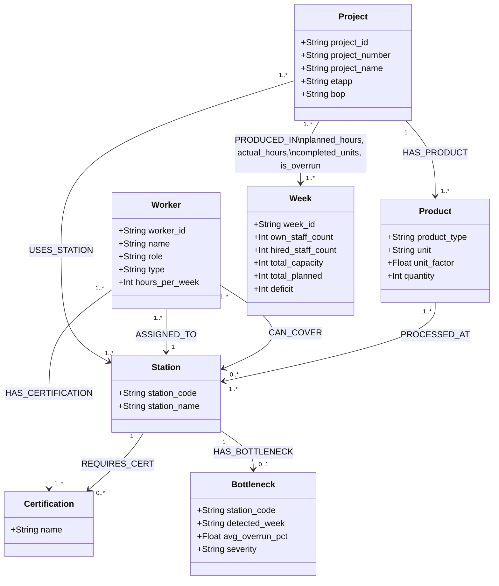

# Factory Knowledge Graph Schema

## Graph Schema Diagram

## Relationship Properties

| Relationship | Properties |
|---|---|
| `(:Project)-[:PRODUCED_IN]->(:Week)` | `planned_hours`, `actual_hours`, `completed_units`, `is_overrun` |
| `(:Worker)-[:CAN_COVER]->(:Station)` | `certified: true/false` |
| `(:Station)-[:HAS_BOTTLENECK]->(:Bottleneck)` | `detected_week`, `avg_overrun_pct`, `severity` |
